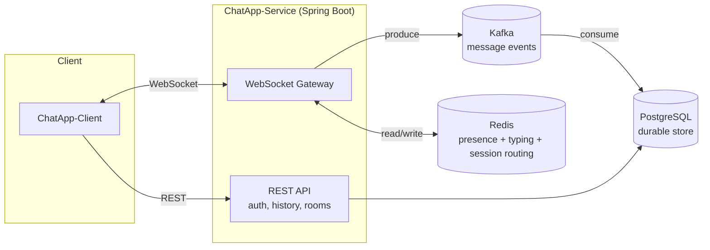

# Chat — System Design

## Status

Early design phase. No implementation exists yet beyond scaffolded modules. This document
describes the intended system at the whole-repo level. Each module has (or will have) its own
`DESIGN.md` with a more detailed treatment:

- [`ChatApp-Service/DESIGN.md`](ChatApp-Service/DESIGN.md) — backend service
- [`ChatApp-Client/DESIGN.md`](ChatApp-Client/DESIGN.md) — client application
- [`ChatApp-Contracts/DESIGN.md`](ChatApp-Contracts/DESIGN.md) — shared API/message contracts

## 1. Goal

A real-time chat application supporting direct messages and group chats, with message
durability, presence, and typing indicators.

## 2. Repo layout

| Module | Responsibility |
|---|---|
| `ChatApp-Client` | End-user client application. Connects to the service over WebSockets, renders conversations, sends/receives messages. |
| `ChatApp-Service` | Backend. Owns connection handling, auth, routing, presence, and message persistence. |
| `ChatApp-Contracts` | Shared definitions (message/event schemas, DTOs) used by both client and service so the wire format has a single source of truth. |

## 3. v1 feature scope

- 1:1 direct messaging
- Group chats / rooms
- Presence (online/offline) and typing indicators
- Message history, persisted and paginated

## 4. High-level architecture

## 5. Tech stack

| Concern | Choice |
|---|---|
| Service framework | Spring Boot |
| Real-time transport | WebSockets |
| Durable storage | PostgreSQL |
| Message queue | Kafka — decouples the WebSocket write path from the DB write path |
| Presence / ephemeral state | Redis |
| Contracts | Shared module (`ChatApp-Contracts`) — format TBD (Java DTOs vs. schema-driven) |

## 6. End-to-end message flow (send → deliver → persist)

1. Client A sends a message over its WebSocket connection to `ChatApp-Service`.
2. The service validates the sender's membership in the target room/conversation.
3. The service publishes a message event to Kafka (keyed by room/conversation ID, to preserve
   per-room ordering).
4. A Kafka consumer within (or alongside) the service persists the message to PostgreSQL.
5. The service fans the message out to other connected members of the room in real time,
   independent of the Kafka → Postgres write completing (delivery is not gated on durability,
   but durability is guaranteed via the queue — see open question in §8).
6. Redis is consulted to know which members are online/which service instance holds their
   WebSocket connection, for routing delivery in a multi-instance deployment.

## 7. Presence & typing

Presence and typing state are ephemeral and live in Redis rather than Postgres:
- A heartbeat/TTL key per connected user tracks online status.
- Typing indicators are short-lived pub/sub events, not persisted.

## 8. Open questions

- **Delivery guarantee**: is at-least-once (with client-side dedup by message ID) acceptable, or
  does v1 need stronger ordering/exactly-once semantics per room?
- **Multi-instance routing**: how does a service instance deliver a message to a user connected
  to a *different* instance? (Redis pub/sub fan-out vs. a dedicated routing table.)
- **Auth**: OAuth via Google for v1 (native account creation planned later). See
  [`ChatApp-Service/DESIGN.md` §8](ChatApp-Service/DESIGN.md#8-auth) for the identity model and
  session flow.
- **Contracts format**: schema-first — see
  [`ChatApp-Contracts/DESIGN.md` §3](ChatApp-Contracts/DESIGN.md#3-format--recommendation) for
  the proposed JSON Schema (client-facing) / Protobuf (Kafka-internal) split.

## 9. Non-goals (v1)

- File/media attachments
- Message search
- End-to-end encryption
- Federation / multi-tenant deployment
